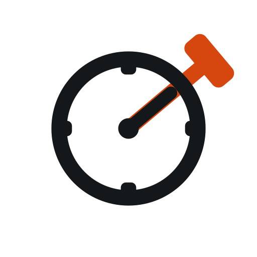

<p align="center">
  
</p>

<h1 align="center">Hevy2Garmin Lite</h1>

<p align="center">
  <a href="LICENSE"></a>
  <a href="https://claude.com/claude-code"></a>
</p>

Enriches a Garmin watch activity **in place** with [Hevy](https://www.hevyapp.com/)'s exercise names, sets, reps, and weights — no FIT files, no deleting the activity, nothing your watch computed (heart rate, Training Effect, EPOC, VO2max, calories) is touched.

You already wear your watch for strength training and log the same session in Hevy. This service just attaches the structured set data Hevy captured — the specific exercises, weights, and reps — onto the activity your watch already recorded. If there's no matching watch activity, the workout is simply not synced; that's treated as a normal outcome, not an error.

## Features

- **Non-destructive by design** — pushes directly to Garmin's `exerciseSets` endpoint on your existing activity. No FIT generation, no re-upload, no risk to watch-computed metrics.
- **Fast + reliable trigger model** — Hevy's `workout.created` webhook is the primary trigger, with retries (default 5/10/15 min) in case the watch hasn't synced to Garmin Connect yet. Optional polling reconciliation catches edits/deletes, which webhooks can't.
- **Exact exercise names, not just categories** — resolves the real Garmin subcategory name (e.g. `BARBELL_BENCH_PRESS`, not just `BENCH_PRESS`) via `fit_tool`, the same package Garmin's own ecosystem uses.
- **"Learn from Garmin"** — for exercises the mapper can't resolve, manually correct them once in Garmin Connect's own "Choose an Exercise" UI, and the app reads that correction back and saves it as a validated mapping for next time — no more guessing subcategory names by hand.
- **Self-healing Garmin auth** — a cached client that re-logs in automatically when its token dies, with MFA handled through the dashboard (no interactive terminal required in a container).
- **Dashboard** — single-page UI for auth status, MFA entry, unmapped-exercise resolution, sync history, and live logs.
- **Dry-run mode** — validate matching and payload construction without writing to Garmin.
- **Docker-only** — one image, multi-arch (`amd64`/`arm64`), everything (including tests and linting) runs in containers.

## How this differs from the original hevy2garmin

[hevy2garmin](https://github.com/drkostas/hevy2garmin) is a great, more general-purpose tool. This project makes a narrower bet in exchange for a simpler, safer story:

| | hevy2garmin | Hevy2Garmin Lite |
|---|---|---|
| Mechanism | Can generate/replace a FIT file, or merge, or write a text description | Only ever patches an existing **watch-recorded** activity via the `exerciseSets` endpoint |
| Watch metrics | A FIT replace regenerates the activity, so watch-computed metrics can be lost | Never touched — the entire reason this project exists |
| No watch activity? | Can still create something from Hevy data alone | Not synced — this assumes you always wear your watch |
| Auth | Cloudflare Worker login proxy | No third-party proxy; self-healing shared token store, same pattern as [garmin-scale-sync](https://github.com/dharmendra-gupta/garmin-scale-sync) |
| Rejection recovery | Per-exercise bisect on a rejected push | Single strip-all-names-and-retry — simpler, accepted tradeoff at this project's scale |
| Custom exercises | N/A (owns FIT content directly) | "Learn from Garmin" read-back loop, since this project can't hand-guess names safely |
| Deployment | CLI/script | Always-on FastAPI service — webhook + polling + dashboard |

If you don't always wear a watch, or want a managed/one-click setup, use hevy2garmin instead. If you always record on both and just want the two data sources merged safely, this is that.

## Prerequisites

- **Docker and Docker Compose**
- **Hevy Pro subscription** (required for API access)
- **A Garmin account**, and ideally a shared token directory with [garmin-scale-sync](https://github.com/dharmendra-gupta/garmin-scale-sync) if you run both on the same host — either service can refresh the shared tokens
- **You wear your watch for strength training** — this is a hard assumption of the design, not a preference

## Quick Start

```bash
git clone <this-repo-url> hevy2garmin-lite
cd hevy2garmin-lite

cp .env.example .env
# edit .env — at minimum: HEVY_API_KEY, GARMIN_EMAIL, GARMIN_PASSWORD

docker compose build
docker compose up -d app
```

Open `http://<host>:8000/` (default port `8000`, from `.env`'s `PORT`) and log in with `API_BASIC_AUTH_USERNAME` / `API_BASIC_AUTH_PASSWORD`.

## Configuration

All configuration is via `.env` (see `.env.example` for the full annotated template). Notable keys:

| Key | Default | Notes |
|---|---|---|
| `HEVY_API_KEY` | — | Requires Hevy Pro |
| `GARMIN_EMAIL` / `GARMIN_PASSWORD` | — | Used only when the shared token store needs a full re-login |
| `HEVY_WEBHOOK_AUTH_TOKEN` | — | Shared secret Hevy sends back on webhook calls |
| `PUBLIC_BASE_URL` | — | Publicly reachable URL for webhook registration; leave blank to rely on polling only |
| `WEBHOOK_RETRY_DELAYS_MINUTES` | `5,10,15` | Retry schedule if no matching watch activity is found yet |
| `MATCH_TOLERANCE_MINUTES` | `15` | Max start-time drift allowed between a Hevy workout and a Garmin activity |
| `SYNC_INTERVAL_MINUTES` | `15` | Fallback polling interval — live-editable from the dashboard once set (persisted in SQLite, not `.env`) |
| `POLLING_ENABLED_DEFAULT` | `false` | Polling is an off-by-default reconciliation safety net, toggleable live from the dashboard |
| `WORKING_SET_SECONDS` / `WARMUP_SET_SECONDS` / `REST_BETWEEN_SETS_SECONDS` / `REST_BETWEEN_EXERCISES_SECONDS` | `40` / `25` / `75` / `120` | Fallback set-timeline estimation inputs — live-editable from the dashboard's Timeline Tuning panel once set (persisted in SQLite, not `.env`) |
| `API_BASIC_AUTH_USERNAME` / `API_BASIC_AUTH_PASSWORD` | `admin` / `change_me` | Dashboard + API auth — change this |
| `DRY_RUN` | `false` | Match and build payloads without pushing to Garmin |
| `GARMIN_TOKEN_HOST_DIR` | `./.garminconnect` | Host path for the shared Garmin token volume |

### Sharing tokens with garmin-scale-sync (or another host)

This app always reads/writes its Garmin session token at the **fixed container path `/app/garmin_tokens_source`** — that path is not configurable, only what's mounted into it is. `GARMIN_TOKEN_HOST_DIR` is a `docker-compose.yml`-only variable (the app itself never reads it); it just controls what host folder gets bind-mounted to `/app/garmin_tokens_source` in *this repo's own* `docker-compose.yml`.

If you're running this app under a different, hand-written compose file (e.g. bundling it alongside garmin-scale-sync and other services on one host), `GARMIN_TOKEN_HOST_DIR` does nothing — you have to add the volume line yourself:

```yaml
services:
  hevy2garmin-lite:
    image: ghcr.io/<owner>/hevy2garmin-lite:latest
    volumes:
      - <shared-host-path>:/app/garmin_tokens_source
```

**The gotcha**: garmin-scale-sync doesn't expose a separate token volume at all — it stores its token inside a `.garminconnect` subfolder of its own `/app/data` mount (i.e. `{garmin-scale-sync's data volume host path}/.garminconnect`). So pointing both services at "the same directory" means mounting *that subfolder* into this app's `/app/garmin_tokens_source`, not garmin-scale-sync's whole data folder:

```yaml
services:
  garmin-scale-sync:
    volumes:
      - ./gss-data:/app/data          # token ends up at ./gss-data/.garminconnect

  hevy2garmin-lite:
    volumes:
      - ./h2glite-data:/app/data      # keep this app's own data separate
      - ./gss-data/.garminconnect:/app/garmin_tokens_source   # <- same token store
```

Mounting the wrong directory (or forgetting the second volume line) doesn't error — the app just silently self-heals into its own private, unshared token, and each service will show a different auth status with no obvious link between them.

## API Reference

All endpoints except the webhook and health check use **HTTP Basic Auth** (`API_BASIC_AUTH_USERNAME` / `API_BASIC_AUTH_PASSWORD`).

| Method | Path | Notes |
|---|---|---|
| `GET` | `/` | Dashboard UI |
| `GET` | `/v1/health` | Unauthenticated — Docker `HEALTHCHECK` target |
| `GET` | `/v1/status` | Auth state, config flags, last run summary — never triggers a login itself |
| `POST` | `/v1/auth/login` | Starts a background Garmin login if not already authenticated/pending |
| `POST` | `/v1/auth/mfa` | Body `{"code": "123456"}` — submits a pending MFA code |
| `POST` | `/v1/sync-now` | Runs a full reconciliation cycle immediately |
| `GET`/`POST` | `/v1/settings/polling` | Read/toggle polling and its interval; `POST` body `{"enabled": bool, "interval_minutes": int}` |
| `GET`/`POST` | `/v1/settings/timeline` | Read/set the set-timeline estimation inputs; `POST` body `{"working_set_seconds", "warmup_set_seconds", "rest_between_sets_seconds", "rest_between_exercises_seconds"}` |
| `POST` | `/v1/webhooks/hevy` | Hevy's own webhook — authenticated via `Authorization` header matching `HEVY_WEBHOOK_AUTH_TOKEN`, not Basic Auth |
| `GET` | `/v1/logs` | Recent log entries; optional `?source=webhook\|polling\|manual` filter |
| `GET` | `/v1/mappings/unmapped` | Exercises with no resolved mapping yet |
| `GET` | `/v1/mappings/categories` | Valid Garmin category strings, for the mapping UI dropdown |
| `POST` | `/v1/mappings` | Body `{"template_id", "category", "note"}` — hand-assign a category-only mapping |
| `GET` | `/v1/sync-history` | Last 50 synced workouts |
| `POST` | `/v1/mappings/learn-from-garmin/{hevy_workout_id}` | Reads back a manual exercise correction from Garmin Connect for an already-synced workout |

### Example: trigger a manual sync

```bash
curl -u admin:your_password -X POST http://<host>:8000/v1/sync-now
```

### Example: submit an MFA code

```bash
curl -u admin:your_password -X POST http://<host>:8000/v1/auth/mfa \
  -H "Content-Type: application/json" \
  -d '{"code": "123456"}'
```

## Exercise Mapping

Every Hevy exercise maps to a Garmin `(category, name)` pair via a bundled catalog (ported from hevy2garmin's template data) resolved dynamically through `fit_tool`. Anything the catalog can't resolve — usually custom, user-created Hevy exercises — falls back to a generic category and is recorded as **unmapped**, visible on the dashboard.

Two ways to fix an unmapped exercise:
1. **Assign a category** from the dashboard's Unmapped table (`POST /v1/mappings`) — quick, but only ever category-level, since a hand-guessed subcategory name can reject the *entire* atomic push.
2. **Learn the exact name from Garmin** — after a workout syncs, manually correct the exercise in Garmin Connect's own "Choose an Exercise" UI, then hit "Re-check Garmin" on that row in Sync History. The app reads back your correction and saves it as a validated exact mapping, so every future sync of that exercise renders correctly without further manual steps.

## Dry-Run Mode

Set `DRY_RUN=true` to run the full match + payload-build pipeline without calling Garmin's `exerciseSets` endpoint or attempting a credential login. Useful for verifying matching behavior against your own data before trusting it with a real push.

## Development & Testing

Everything runs in Docker — there is no local Python environment.

```bash
docker compose build              # build all service images
docker compose run --rm test      # full pytest suite
docker compose run --rm lint      # ruff
docker compose run --rm spike     # live validation push (real account write, requires typed 'yes')
docker compose run --rm reauth    # manual credential bootstrap (rarely needed — the app self-heals)

# single test file / single test:
docker compose run --rm --entrypoint python test -m pytest tests/test_matcher.py -v
docker compose run --rm --entrypoint python test -m pytest tests/test_matcher.py::test_exact_overlap_matches -v
```

See `CLAUDE.md` and `ai-docs/` for architecture deep-dives, a dense fact-lookup reference, and the full implementation history.

## CI/CD

GitHub Actions, modeled on garmin-scale-sync's own pipeline:
- **`test.yml`** — runs lint + the full test suite (via Docker) on every push/PR to `main`; comments on the PR once both pass.
- **`publish.yml`** — builds and pushes multi-arch (`amd64`/`arm64`) images to GitHub Container Registry on a successful `main` run or a published release.

## License

[GPL-3.0](LICENSE)

## Acknowledgements

- [python-garminconnect](https://github.com/cyberjunky/python-garminconnect) by Ron Klinkien ([@cyberjunky](https://github.com/cyberjunky)) — the Garmin Connect API client this project builds on.
- [hevy2garmin](https://github.com/drkostas/hevy2garmin) — prior art for exercise-template mapping and the `fit_tool`-based name resolution approach this project mirrors.
- [garmin-scale-sync](https://github.com/dharmendra-gupta/garmin-scale-sync) — the sibling project this one's self-healing auth pattern and dashboard shape are deliberately modeled on.
- Built AI-assisted with [Claude Code](https://claude.com/claude-code) (Anthropic) — architecture, implementation, tests, docs, and the icon design were all developed in collaboration with Claude.
